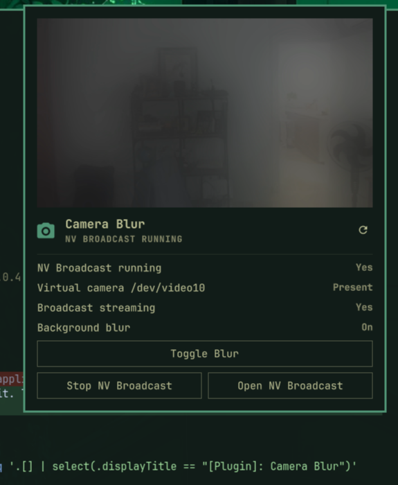

# Camera Blur

Camera Blur adds NV Broadcast controls to the Omarchy bar. It shows status and previews the processed virtual camera.

The plugin does not process video. It controls the separate [NV Broadcast](https://github.com/Hkshoonya/nvidia-broadcast-linux) application.



## Features

- Toggle background blur from the bar.
- Start, stop, or open NV Broadcast.
- Show application, virtual-camera, stream, and blur status.
- Preview the processed `/dev/video10` feed.

## Requirements

- Omarchy 4 or later
- NV Broadcast from the tested source revision below
- `v4l2loopback`
- `qt6-multimedia`
- An NVIDIA GPU for CUDA processing

NV Broadcast is an unofficial NVIDIA Broadcast alternative. Its GPL-3.0 license and upstream security model apply separately.

## Install NV Broadcast

The AUR package does not contain the remote actions that this plugin needs. Use the reviewed installer from this repository:

```bash
git clone https://github.com/kyryl-bogach/omarchy-camera-blur.git &&
cd omarchy-camera-blur &&
./scripts/install-nvbroadcast.sh "$HOME/Applications/nvidia-broadcast-linux"
```

The installer supports CPython 3.14 on Linux x86_64. It checks out NV Broadcast commit `328c318fd260e1bea01e87f184023fba69c172c3`.

The installer applies the reviewed Hyprland action patch. It also configures `/dev/video10` through the upstream installer.

The CUDA lock pins each Python package to one version and one SHA-256 wheel hash. The installer enforces the lock with `pip --require-hashes --only-binary=:all: --ignore-installed`.

Review these files before you run the installer:

- `scripts/install-nvbroadcast.sh`
- `requirements/nvbroadcast-cuda-py314.lock`
- `patches/nvbroadcast-328c318f.patch`

The upstream installer can install Arch packages and configure system services. The NV Broadcast GPL-3.0 license and security model apply separately.

## Install the plugin

```bash
omarchy plugin add https://github.com/kyryl-bogach/omarchy-camera-blur.git --enable
```

## Use the plugin

Left-click the bar icon to toggle blur. If NV Broadcast is stopped, left-click opens the panel.

Middle-click or right-click opens the panel. The panel contains the preview, status, and application controls.

NV Broadcast streams only while its window is open. Leave the window open on another workspace during use.

Set `minimize_on_close = false` in `~/.config/nvbroadcast/config.toml`. Closing the window then stops the application instead of its stream only.

If the first preview cannot find `/dev/video10`, restart the Omarchy shell once:

```bash
omarchy restart shell
```

Qt caches camera discovery in the shell process. Later logins discover the virtual camera during shell startup.

## Select the camera in each application

Select **NVbroadcast** in applications that need the processed feed. Select the physical camera when you do not need processing.

Some Chromium versions hide loopback cameras behind the PipeWire camera flag. Disable that flag if `NVbroadcast` does not appear.

## Privacy and permissions

The plugin runs unsandboxed inside the Omarchy shell. It can start or stop NV Broadcast and read its local configuration.

The plugin does not use the network. NV Broadcast can download models and has its own privacy and security behavior.

## Remove

```bash
omarchy plugin remove io.github.kyryl-bogach.camera-blur
```

This command removes only the plugin. Remove NV Broadcast and `v4l2loopback` separately if you no longer need them.

## Develop

Validate the manifest and run the model tests:

```bash
omarchy plugin validate .
/usr/lib/qt6/bin/qmltestrunner -input tests -import .
```

## License

This plugin uses the MIT license. NV Broadcast remains a separate GPL-3.0 project.
